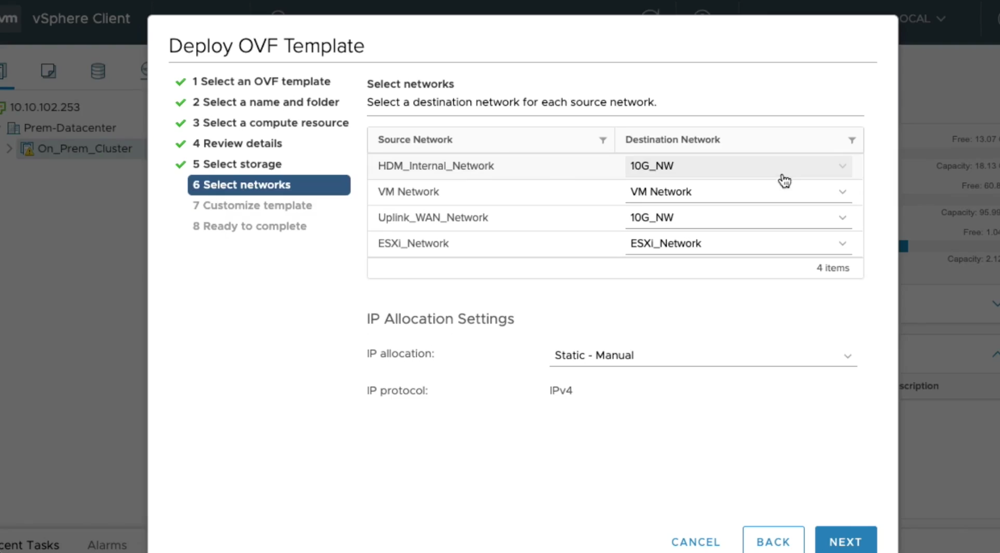

This video will explain the networks that need to be configured on the HDM 
appliance during deployment.

To configure the networks correctly you would need to refer to the "network planning"
section of online documentation. This explain then underlying 
connectivity HDM requires to the "Cloud" to perform migration operations. 
---

In this screen the "HDM Internal Network" is the network on which the HDM components will use for its internal communication.

--- 

The "VM Network" is the network over which the vCenter is accessible. This would generally be the management network. Use the drop down to select the network on your setup which has access to the vCenter. In our example it is "VM Network"
but could be different in your setup.

--- 

The "Uplink WAN Network" is the network over which we can connect to the cloud.
You would have configured the IPSec tunnel to the cloud through this network.

--- 

The "ESXi Network" is the network over which the ESXi servers part of the cluster being migrated can be accessed. It is not uncommon for the vCenter to be also 
configured on the same network. In this case both the "VM Network" configured earlier
and "ESXi Network" in this step would point to the same network.
--- 

After selecting the networks, we now need to select how these network interfaces are configured, "Static IP" or "DHCP".

The *Static* option lets you configure a static IP for the above network interfaces. 

The *DHCP* will configure network configuration using the DHCP protocol.

The *Static-Pool* and *Transient-Pool* options aren't supported for the ovf deployment.

