This Video will give an overview of how networking is configured for HDM and how you can map your datacenter network for use in HDM.
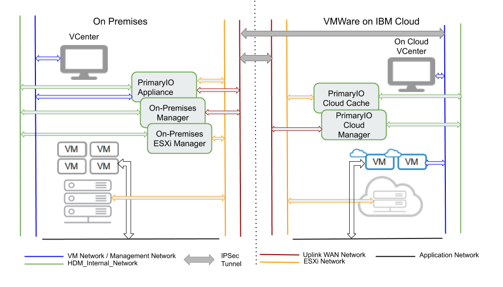

This diagram shows a typical network configuration of a typical vSphere and how they would configure the cloud.
On the left you have the on premises setup with the with the vCenter which is controlling the ESXi part of the 
datacenter. On the right you have the cloud. The cloud and the premises are connected over the WAN.

First lets start with the configuration on premises. 

--- 

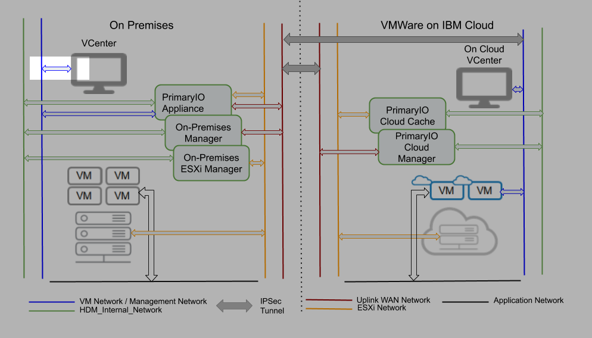

The blue network is the Management network over which the vCenter is configured. The PrimaryIO appliance will require
access to the vCenter to configure and manage migrations.  
--- 
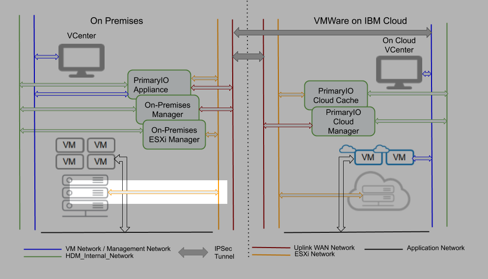

The network in yellow is the ESXi network. Very often the the ESXi and the ESXi and the management networks are
configured over the same network. 

--- 

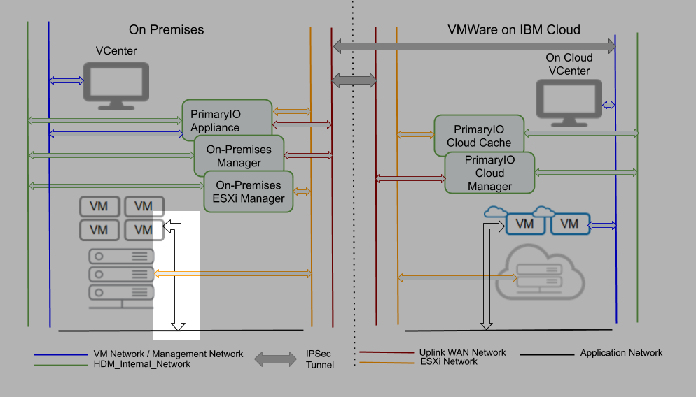
Generally it is desireable to seperate the application VM traffic from the managment traffic. To this end
you have a seperate application network configured for use by the appication VMs.
The Virtual Machines and applications traffic is configured over the "Application Network".
--- 
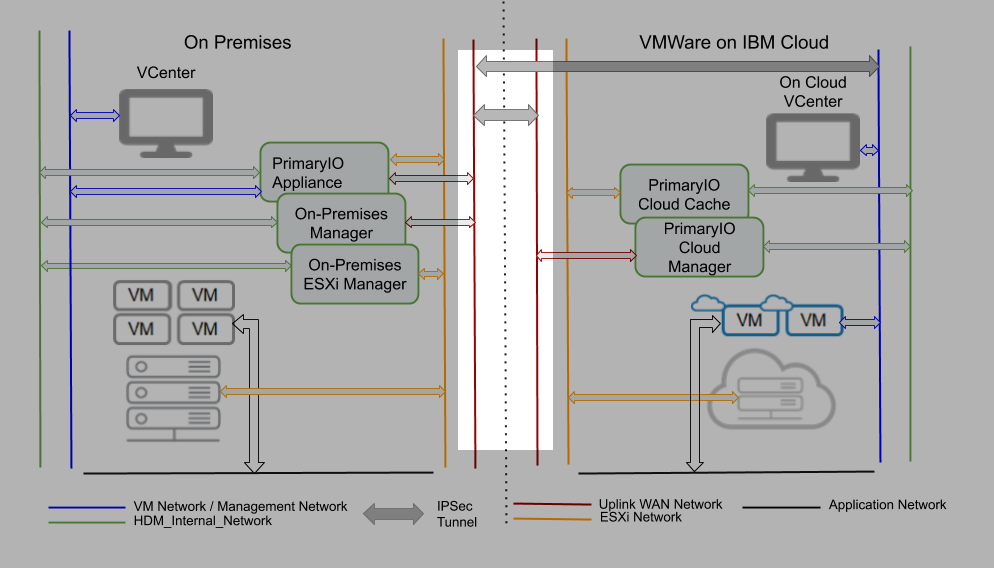
The "Uplink wan Network" is the network over IPSec tunnel to the cloud is configured. 

--- 
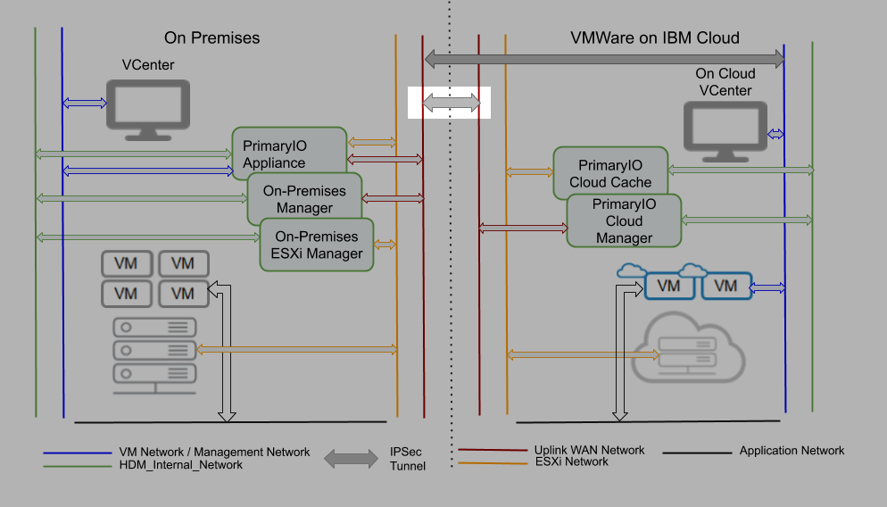
There are two 
--- 
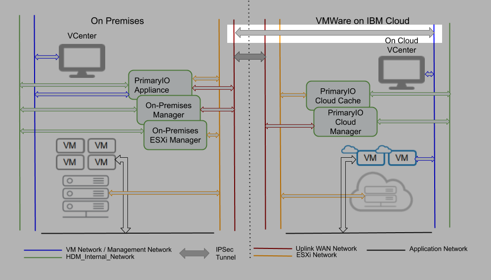
IPSec VPN tunnels configured between the premises and the cloud.

--- 
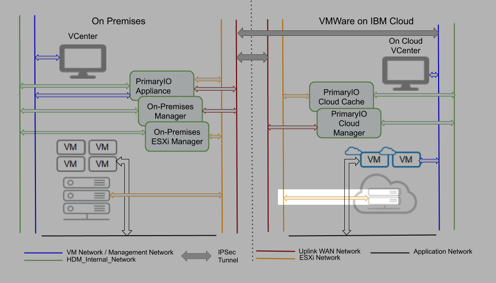
Like the premises there is a "ESXi network" over which the ESXi can be accessed
--- 
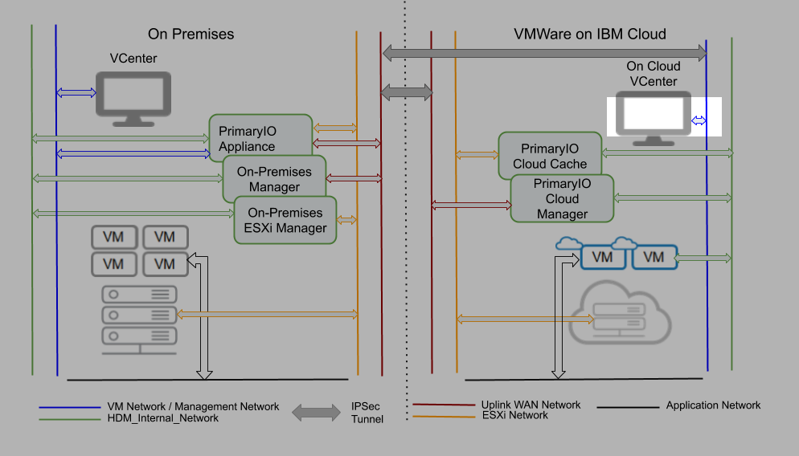
and the VM Network over which the vCenter can be reached.
--- 
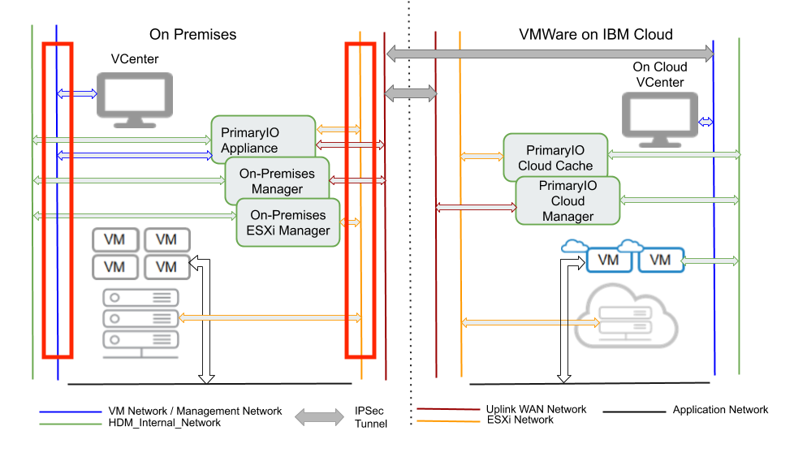
It is not uncommon for both all the ESXi and the vCenter to be configured over the same network.

--- 
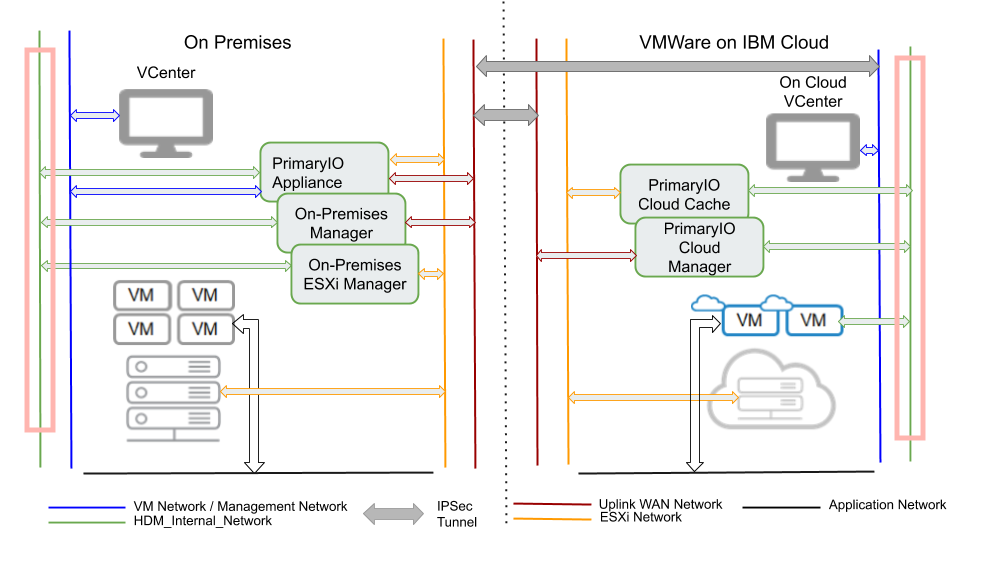
The "HDM Internal Network" is the private network over which the components of HDM communicate with each other.

--- 
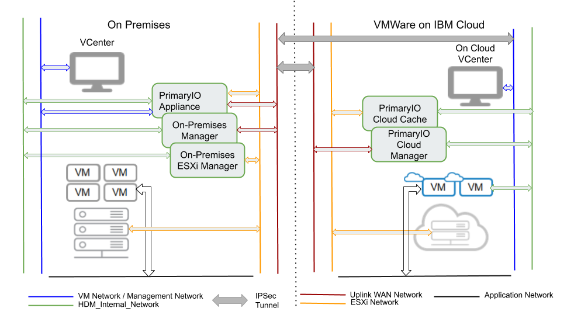
This is the most flexible configuration of HDM possible. However depending on how your application or premises network is configured
one or more of the networks might be combined into one. Corresponding to these we have specialized guides for a "Single Network" configuration and
a "Multi-Network" configuration.
